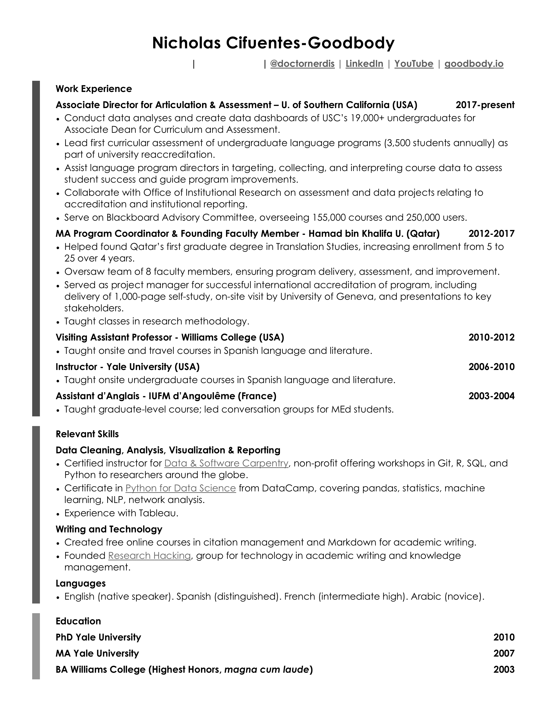

# Teaching Demonstration for the Data Incubator

Thank you for considering my application to be a Data Scientist in Residence at the Data Incubator. For my demonstration, I've been asked to prepare a Jupyter Notebook that provides and accessible explanation of hypothesis testing and Bayesian posterior inference.

My demonstration notebook is available [here](teaching-demo.ipynb). If you'd like to see how I generated the data I use in the demo, there is a separate notebook [here](create-pizza-data.ipynb).

My demo requires the following libraries:

* `matplotlib`
* `numpy`
* `pandas`
* `pymc3`
* `scipy`
* `seaborn`
* `sklearn`

And the following extension:

* [jupyter_contrib_nbextensions](https://github.com/ipython-contrib/jupyter_contrib_nbextensions)

If you don't want to install any of this, you can launch the repository in as a [binder](https://mybinder.org). Click on the button above.

# Resume

 

([Download PDF](images/2018-10-29_cifuentes-goodbdody_resume.pdf))